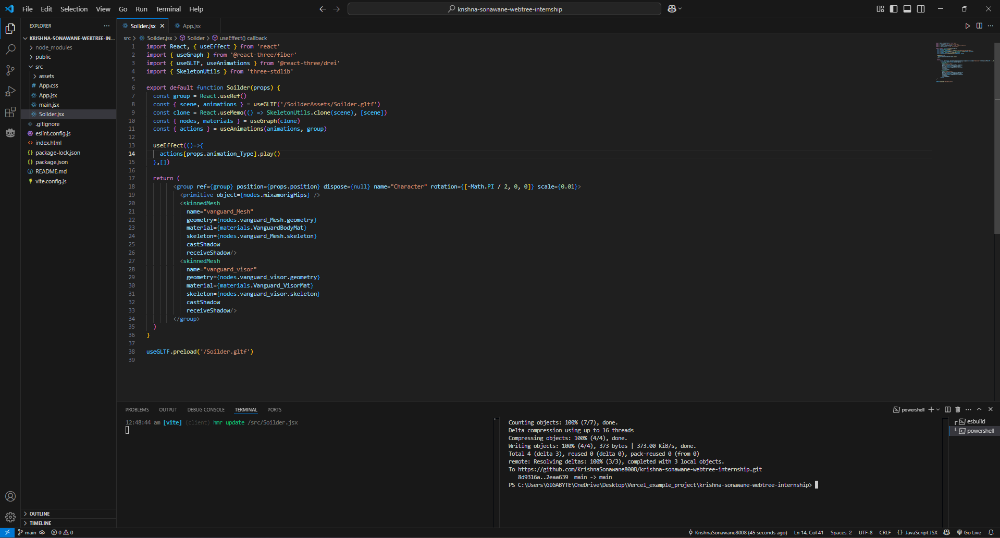

The boilerplate for model importing is generated using the command: npx gltfjsx src/assets/SoilderAssets/Soilder.gltf 
 
Playing Animation is handeled in the useEffect hook with an array which stores the action objects.
 
You can see so, below:

 
 
<h4>Final OutPut:</h4>
<video src="https://github.com/user-attachments/assets/b0ac06f6-d061-44d5-91b0-226fbc66afdd"></video>
